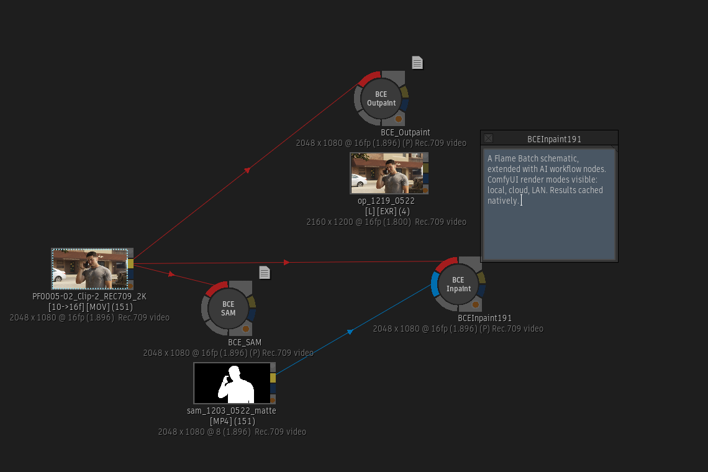

# BCE — Batch Comfy Extensions

**Bring ComfyUI workflows into Autodesk Flame's Batch.**



BCE is a whole system for using and making Batch nodes that do Comfy workflows. A BCE node reads parameters in our familiar UI, patches a ComfyUI workflow template with those
values, and renders through your chosen backend — local Comfy, a LAN render node, or Comfy Cloud. The result imports back into Flame as a cached clip. All your Comfy settings, including seeds, are saved in your Batch setups.

If you've ever wanted to drop a ComfyUI workflow into the middle of a
Batch tree without leaving Flame, this is that.

---

## What's in the box

Three node categories, each with several templates, covering a class of Comfy workflow:

- **BCE Outpaint** — extend single frames
- **BCE Inpaint** — replace or remove content using a matte
- **BCE SAM** — use Segment Anything Models to generate mattes. Better than the Semantic keyer and faster than whatever Magic Mask thing you were doing. 

Three render backends, switched with a toggle in Setup:

- **Local** — ComfyUI on your workstation
- **LAN** — ComfyUI on a render node, via a shared filesystem
- **Cloud** — Comfy Cloud (account + API key)

You can use more than one — local for fast iteration, LAN if you have a render node, or cloud for offsite rendering. Cloud is good for when your GPU is busy, and great if you're on a Mac.

---

## Why BCE

A few things BCE does differently than the typical "drop a PNG into
Comfy" workflow:

- **Imports stay.** BCE forces MediaHub cache mode during import, so
  every result lands as a fully cached clip in Flame. Job folders on
  disk are safe to delete — your timeline keeps the media. No "missing
  source media" surprises after a purge.
- **Deterministic and archive-safe.** Every parameter — prompt, seed,
  sliders, every Matchbox value — lives in the Flame Batch setup. The
  prompt itself is stored in the BCE node's Note (to finally put that to good use). Pull a Batch setup out
  of archive six months later, re-render, get the exact same result.
- **16-bit float EXR end-to-end on local and LAN.** Source plates go
  to Comfy as EXR and results come back as EXR — no PNG round-trip, no
  8-bit quantization between Flame and inference.
- **Cloud uses 16-bit RGBA TIFF transport.** Comfy Cloud doesn't
  currently support EXR `LoadImage`, so BCE uploads sources as 16-bit
  TIFF and gets EXR back. It's a kludge, and it's named as one — when
  cloud EXR support lands, BCE will switch.
- **Color space is preserved.** The clip BCE imports back into Flame
  wears the color space tag of the source clip — tested across project
  defaults plus oddballs like BMD Film and RED Dragon. Comfy's side of
  the pipeline is still yours to manage in your templates.
- **Three backends, one workflow.** Switch between local, LAN, and
  Comfy Cloud with a toggle in Setup. The same BCE template runs on
  all three (with some node compatibility caveats — see
  [workflows.md](docs/workflows.md)).
- **No black-box patching.** Every shipped template is a normal
  ComfyUI JSON. The `[BCE:*]` tag contract is the only thing BCE
  cares about; everything else is yours to inspect, change, or replace.

The trade-off: BCE constrains a workflow to what its Matchbox UI
exposes. For one-off experiments and workflows BCE doesn't cover,
fall back to ComfyUI directly. BCE is for the workflows you want to
drive from Flame.

---

## Install

Download the release zip, unzip, run the installer:

```
./install_bce.sh
```

Then **BCE → Setup and Config** in Flame.

See **[install.md](docs/install.md)** for the full walkthrough, including
picking and configuring a backend.

---

## Documentation

- **[install.md](docs/install.md)** — install, setup, backend choice
- **[usage.md](docs/usage.md)** — the prep/launch/import lifecycle, seeds, job folders
- **[workflows.md](docs/workflows.md)** — per-template guidance, backend compatibility
- **[troubleshooting.md](docs/troubleshooting.md)** — common errors and fixes
- **[comfy_install.md](docs/comfy_install.md)** — installing ComfyUI on Linux
- **[GLOSSARY.md](GLOSSARY.md)** — terms, naming conventions, job folder layout
- **[CLAUDE.md](CLAUDE.md)** — repo context, for AI assistants and contributors

---

## Requirements

- Autodesk Flame 2023 or later, Linux or Mac
- One backend: a local NVIDIA GPU, a LAN render node, or a Comfy Cloud account

---

## Approach

BCE treats GenAI as plate generation, not procedural reproducibility.
You're rendering an image, not building a deterministic pipeline node.
Iterate, pick a take, move on.

---

## Open by design

BCE is built to be extended, not just used. Three places the door is
deliberately left open:

**Your own workflows.** Every shipped template is a normal ComfyUI
JSON. Open it in Comfy, modify it, retag the nodes with `[BCE:*]`,
drop it back into BCE. The tag contract is the only thing BCE cares
about — everything else is yours to change.

**Your own templates.** Pick a different model, swap a sampler,
change resolution behavior, add a control net. Save the JSON to
`~/bce/templates/` and point your BCE node at it. No code changes
needed.

**Your own node categories.** When a workflow is shaped enough
differently that it needs its own UI (video instead of stills, two
inputs instead of one), copy an existing `bce_<node>.py`, edit the
constants at the top, build a matching Matchbox UI, and you have a
new BCE node type. The four-file pattern (`bce_<node>.py`,
`bce_launch.py`, `bce_lib.py`, `bce_runner.py`) keeps "the file you
edit" small. See [CLAUDE.md](CLAUDE.md) and [GLOSSARY.md](GLOSSARY.md)
for the contract details.

---

## Credits

- ComfyUI, the engine BCE drives.
- The Logik community, especially Michael V (pyflame.com) for the Flame
  Python style and reference scripts that helped define BCE's shape.
- The Radiance Digital Cinema custom nodes for the EXR pipeline.

---

## Author

Built by Beak for the Flame community.
Find me on [Logik](https://forum.logik.tv).

---

## License

See [license](docs/license).
